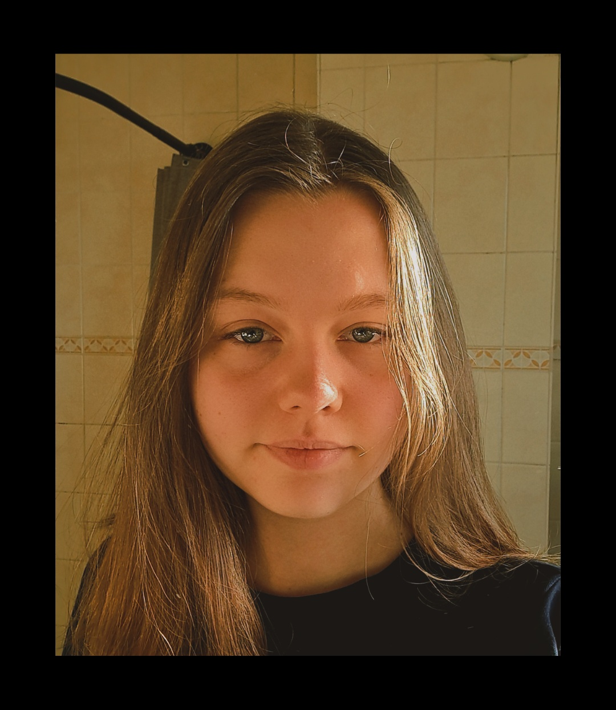

<!DOCTYPE html>

<html lang="nl">

&nbsp; <head>

&nbsp;   <meta charset="UTF-8">

&nbsp;   <meta name="viewport" content="width=device-width, initial-scale=1.0">

&nbsp;   <title>FDND Visitekaartje</title>

&nbsp;   <link rel="stylesheet" href="styles/style.css">

&nbsp; </head>

&nbsp; <body>

&nbsp;   

&nbsp;   <article class="profile-card-example">

&nbsp;     

&nbsp;     <header class="profile-card-example-header">

&nbsp;       

&nbsp;       <h1>Kayleigh van der Ham</h1>

&nbsp;       

&nbsp;       
<em>Frontend student</em>

&nbsp;       

&nbsp;       <button class="profile-card-example-button">

&nbsp;         <svg width="24" height="24" viewBox="0 0 24 24" stroke-width="1.5" stroke="#2c3e50" fill="none" stroke-linecap="round" stroke-linejoin="round">

&nbsp;           <title>Wijzig layout</title>

&nbsp;           <path stroke="none" d="M0 0h24v24H0z" fill="none"></path>

&nbsp;           <path d="M4 8v-2a2 2 0 0 1 2 -2h2"></path>

&nbsp;           <path d="M4 16v2a2 2 0 0 0 2 2h2"></path>

&nbsp;           <path d="M16 4h2a2 2 0 0 1 2 2v2"></path>

&nbsp;           <path d="M16 20h2a2 2 0 0 0 2 -2v-2"></path>

&nbsp;         </svg>

&nbsp;         <svg width="24" height="24" viewBox="0 0 24 24" stroke-width="1.5" stroke="red" fill="none" stroke-linecap="round" stroke-linejoin="round">

&nbsp;           <path stroke="none" d="M0 0h24v24H0z" fill="none"></path>

&nbsp;           <path d="M15 19v-2a2 2 0 0 1 2 -2h2"></path>

&nbsp;           <path d="M15 5v2a2 2 0 0 0 2 2h2"></path>

&nbsp;           <path d="M5 15h2a2 2 0 0 1 2 2v2"></path>

&nbsp;           <path d="M5 9h2a2 2 0 0 0 2 -2v-2"></path>

&nbsp;         </svg>

&nbsp;       </button>

&nbsp;       

&nbsp;     </header>

&nbsp; 

&nbsp;     

&nbsp;     <dl class="profile-card-example-dl">

&nbsp;       <dt>HTML</dt>

&nbsp;       <dd>✓</dd>

&nbsp;       

&nbsp;       <dt>CSS</dt>

&nbsp;       <dd>✓</dd>

&nbsp;       

&nbsp;       <dt>JavaScript</dt>

&nbsp;       <dd>✓</dd>

&nbsp;     </dl>

&nbsp; 

&nbsp;     
Het WEB is te gek!   Met HTML, CSS en JS kan ik vette, interactieve web apps maken.

&nbsp;     

&nbsp;   </article>

&nbsp;   

&nbsp;   

&nbsp; </body>

</html>

# css

\* {

&nbsp; box-sizing: border-box;

}

html:has(.profile-card-example) {

&nbsp; height: 100vh;

}

body:has(.profile-card-example) {

&nbsp; display: flex;

&nbsp; justify-content: center;

&nbsp; align-items: center;

&nbsp; height: 100vh;

&nbsp; font-family: open sans;

&nbsp; color: #fff;

}

article.profile-card-example {

&nbsp; position: relative;

&nbsp; display: flex;

&nbsp; flex-direction: column;

&nbsp; align-items: center;

&nbsp; justify-content: flex-end;

&nbsp; width: 50vw;

&nbsp; max-width: 25em;

&nbsp; min-width: 20em;

&nbsp; border-radius: 1rem;

&nbsp; background: #ff99be;

&nbsp; background: linear-gradient(0deg, #ff99be 40%, #7b173b 100%);

&nbsp; box-shadow: 0 0 20px 20px rgba(0,0,0,.1);

&nbsp; transition: .25s;

}

header.profile-card-example-header {

&nbsp; display: flex;

&nbsp; flex-direction: column;

&nbsp; justify-content: center;

&nbsp; align-items: center;

&nbsp; justify-content: flex-end;

&nbsp; /\* Je kunt selectors nesten! \*/

&nbsp; h1 {

&nbsp;   margin: 2rem 0 1rem;

&nbsp;   color: #fff;

&nbsp; }

}

button.profile-card-example-button {

&nbsp; position: absolute;

&nbsp; right: 1rem;

&nbsp; top: 1rem;

&nbsp; width: 2.5rem;

&nbsp; height: 2.5rem;

&nbsp; padding: .25rem;

&nbsp; border: none;

&nbsp; border-radius: 50%;

&nbsp; background: #bd8b9d;

&nbsp; transform: scale(.8);

&nbsp; transition: .25s;

}

button.profile-card-example-button:focus {

&nbsp; outline: none;

&nbsp; background: #fff;

}

button.profile-card-example-button svg {

&nbsp; position: absolute;

&nbsp; top: calc(1.25rem - 12px);

&nbsp; left: calc(1.25rem - 12px);

&nbsp; stroke: #fff;

&nbsp; transition-delay: .25s;

}

button.profile-card-example-button:focus svg {

&nbsp; stroke: #fff;

}

button.profile-card-example-button svg:nth-of-type(2) {

&nbsp; opacity: 0;

&nbsp; transition-delay: 0ms;

}

.profile-card-example-img {

&nbsp; position: relative;

&nbsp; top: 2rem;

&nbsp; width: 10em;

&nbsp; height: auto;

&nbsp; border: 5px solid #fff;

&nbsp; border-radius: 10em;

&nbsp; box-shadow: 0 0 2px 2px #fff;

&nbsp; transition: .25s .15s;

}

.profile-card-example-dl {

&nbsp; display: grid;

&nbsp; grid-template-columns: 1fr 1fr 1fr;

&nbsp; grid-template-areas:

&nbsp;   "html-dd css-dd js-dd"

&nbsp;   "html-dt css-dt js-dt"

&nbsp;   ;

&nbsp; justify-items: center;

&nbsp; align-items: start;

&nbsp; width: 100%;

&nbsp; margin-top: -3rem;

&nbsp; margin-bottom: 0;

&nbsp; padding: 5rem 0 3rem;

&nbsp; text-align: center;

&nbsp; 

&nbsp; dt {

&nbsp;   margin-top: .25rem;

&nbsp;   padding-top: .25rem;

&nbsp;   border-top: 1px solid #fff;

&nbsp;   font-weight: bold;

&nbsp;   \&:nth-of-type(1) {

&nbsp;     grid-area: html-dt;

&nbsp;   }

&nbsp;   \&:nth-of-type(2) {

&nbsp;     grid-area: css-dt;

&nbsp;     transform: translateY(1rem);

&nbsp;   }

&nbsp;   \&:nth-of-type(3) {

&nbsp;     grid-area: js-dt;

&nbsp;   }

&nbsp; }

&nbsp; dd {

&nbsp;   margin: 0;

&nbsp;   padding-left: .3rem;

&nbsp;   transition: .25s .3s;

&nbsp;   \&:nth-of-type(2) {

&nbsp;     transform: translateY(1rem);

&nbsp;   }

&nbsp; }

}

.profile-card-example p {

&nbsp; margin: 0;

}

.profile-card-example > p {

&nbsp; width: 100%;

&nbsp; margin-top: 0;

&nbsp; padding: 3rem 2rem;

&nbsp; border-radius: 0 0 1rem 1rem;

&nbsp; text-align: center;

&nbsp; background: rgba(255,255,255, 0.5);

}

/\* Deze styles zijn van toepassing als je op de knop klikt \*/

body.is-expanded {

&nbsp; font-size: 1.15em;

}

body.is-expanded .profile-card-example {

&nbsp; width: 60vw;

&nbsp; max-width: 60vw;

}

body.is-expanded .profile-card-example-button svg:first-of-type {

&nbsp; opacity: 0;

&nbsp; transition-delay: 0ms;

}

body.is-expanded .profile-card-example-button svg:nth-of-type(2) {

&nbsp; opacity: 1;

&nbsp; transition-delay: .25s;

}

body.is-expanded .profile-card-example-dl dd {

&nbsp; font-size: 1.75em;

}

body.is-expanded .profile-card-example-img {

&nbsp; width: 15em;

}

# js

/\* Stap 1: Selecteer de knop \*/

let expandButton = document.querySelector('.profile-card-example-button')

/\* Stap 2: Wacht tot iemand op die knop klikt \*/

expandButton?.addEventListener('click', function() {

&nbsp; /\* Stap 3: Verander een class zodra iemand op die knop klikt \*/

&nbsp; document.body.classList.toggle('is-expanded')

})

